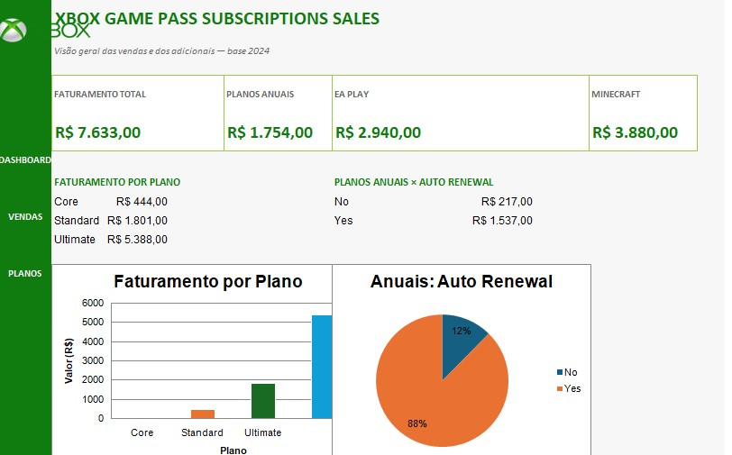

# 🎮 Xbox Game Pass — Sales Dashboard

### Dashboard de análise de vendas e assinaturas desenvolvido em Excel

<!--

-->

-->

---

## 📊 Sobre o projeto

Este projeto consiste na criação de um **Dashboard de análise de vendas e assinaturas do Xbox Game Pass**, desenvolvido no **Microsoft Excel**.

A proposta foi transformar uma base de dados de assinaturas em uma ferramenta visual de apoio à análise, utilizando indicadores, gráficos e perguntas de negócio para facilitar a interpretação dos resultados.

O dashboard foi desenvolvido com uma abordagem visual semelhante a uma aplicação, priorizando organização, clareza e facilidade de leitura.

## Objetivo

O objetivo do projeto é analisar os dados de vendas e assinaturas do Xbox Game Pass, transformando informações da base em **indicadores e visualizações que auxiliem na compreensão do desempenho comercial**.

Entre os principais pontos analisados estão:

* Faturamento de planos anuais;
* Renovação automática das assinaturas anuais;
* Faturamento relacionado ao EA Play;
* Faturamento relacionado ao Minecraft Season Pass;
* Distribuição do faturamento entre os diferentes planos;
* Distribuição das assinaturas por período de contratação.

##  Perguntas de negócio

O dashboard foi estruturado a partir de quatro perguntas principais:

1. **Qual é o faturamento total das vendas de planos anuais?**
2. **Como o faturamento dos planos anuais se divide entre clientes com e sem renovação automática?**
3. **Qual é o faturamento total das assinaturas do EA Play?**
4. **Qual é o faturamento total das assinaturas do Minecraft Season Pass?**

##  Principais KPIs

O dashboard apresenta indicadores de destaque para:

* **Faturamento total**
* **Faturamento de planos anuais**
* **Faturamento do EA Play**
* **Faturamento do Minecraft Season Pass**
* **Total de assinaturas**

Também são apresentados indicadores complementares para facilitar a leitura dos resultados.

## Visualizações

Entre os recursos visuais utilizados estão:

* Faturamento por plano;
* Comparação de planos anuais com e sem renovação automática;
* Faturamento por tipo de assinatura;
* Cards de indicadores (KPIs);
* Informações complementares sobre a base de assinaturas.

## Estrutura do projeto

O arquivo foi organizado em quatro áreas principais:

| Aba           | Descrição                                                             |
| ------------- | --------------------------------------------------------------------- |
| **Assets**    | Recursos visuais utilizados no projeto                                |
| **Bases**     | Base de dados das assinaturas                                         |
| **Cálculos**  | Fórmulas e cálculos utilizados para responder às perguntas de negócio |
| **Dashboard** | Painel visual com KPIs, gráficos e indicadores                        |

## Ferramentas utilizadas

* **Microsoft Excel **
* Fórmulas e funções de análise de dados
* Gráficos
* Formatação condicional e recursos visuais do Excel
* Organização de indicadores e KPIs
* GitHub para documentação e apresentação do projeto

## Identidade visual

O dashboard utiliza uma identidade visual inspirada no universo **Xbox**, com predominância de tons de verde, fundo claro e elementos organizados em formato de painel.

A proposta visual foi desenvolver uma apresentação com **aparência de aplicação**, evitando o aspecto de uma planilha tradicional.

## Compatibilidade

O projeto foi desenvolvido no **Microsoft Excel 2007**.

Como o Excel 2007 não possui alguns recursos presentes em versões mais recentes, como as **Segmentações de Dados (Slicers)**, o dashboard foi adaptado utilizando recursos compatíveis com essa versão do Excel.

## 📚 Aprendizados

Durante o desenvolvimento do projeto, foram trabalhados conceitos importantes de:

* Construção de dashboards;
* Definição e utilização de KPIs;
* Transformação de dados em informações visuais;
* Formulação de perguntas de negócio;
* Análise de vendas e assinaturas;
* Organização de bases e cálculos;
* Construção de gráficos para apoio à tomada de decisão;
* Apresentação de projetos de dados de forma visual e profissional.

## 🚀 Resultado

O resultado é um dashboard desenvolvido em Excel que transforma uma base de dados de assinaturas em uma **visão visual e organizada dos principais indicadores comerciais**.

O projeto demonstra a aplicação prática de conceitos de **análise de dados, indicadores, KPIs e visualização de informações**, utilizando uma ferramenta acessível e compatível com o Excel 2007.

---

### 🎮 Xbox Game Pass — Sales Dashboard

**Excel • Data Analysis • KPIs • Dashboard • Business Questions**

